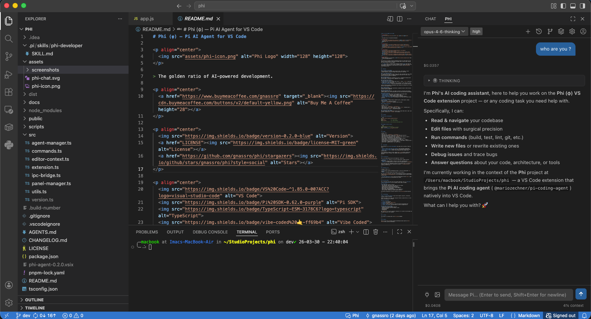

# Phi (φ) — Pi AI Agent for VS Code

<p align="center">
  
</p>

> The golden ratio of AI-powered development.

<p align="center">
  
  <a href="LICENSE"></a>
  <a href="https://github.com/gnassro/phi/stargazers"></a>
</p>

<p align="center">
  
  
  
  
  
</p>

<p align="center">
  Support the project by giving the <a href="https://github.com/gnassro/phi">repo</a> a ⭐ and showing some ❤️!
</p>

Phi brings the [Pi](https://github.com/badlogic/pi-mono) AI coding agent into VS Code as a native extension. Chat with an AI agent that can read, write, and edit your code — directly from the sidebar.

> **⚠️ Note:** Phi is a community-built extension and does **not** yet cover the full Pi agent feature set. It's a work in progress, built through vibe coding, and we welcome all contributions to help reach full Pi parity. See [Contributing](#contributing) below.

<p align="center">
  
</p>

---

## ✨ Features

### 💬 AI Chat in the Sidebar
A full-featured chat interface right inside VS Code. Send messages, receive streamed responses, and watch the agent think and work in real time. Assistant code blocks are syntax-highlighted across many programming languages and follow your VS Code theme.

### 🛠️ Tool Execution Cards
See exactly what the agent is doing — read, write, edit, and bash tool calls render as collapsible cards with live output streaming, inline diffs for edits, copy buttons, and auto-collapse on completion.

### 🧠 Thinking Blocks
When the model thinks before responding, you see it. Collapsible thinking blocks show the agent's reasoning process, toggleable from settings.

### 📂 Editor-Aware Context
Phi knows what you're working on:
- **Add selection to chat** — select code, press `⌘+` (Mac) / `Ctrl++` (Win/Linux), or right-click → "Phi: Add to Chat"
- **Add file to chat** — right-click a file in Explorer → "Phi: Add File to Chat"
- **Attach files** — click the 📎 button in the input area to attach images or any file type via the native file picker
- **Paste images** — paste images from clipboard (`Cmd+V`) to attach them inline
- **Ask about selection** — right-click selected code → "Phi: Ask About Selection"

Context references appear as lightweight chips showing the filename only — Pi reads the full file content itself.

### 📜 Session History
Browse and switch between past conversations, grouped by project. Search sessions by name. Favorites supported. Restored chats show the full current branch and mark where context compaction happened, with expandable compaction summaries.

### 🌿 Conversation Tree
Navigate conversation branches, set labels on entries, and branch with optional context summaries. Full tree visualization with role icons and branch count badges.

### 🔧 Model & Settings
- **Model dropdown** with search — switch between all available models
- **Thinking level** — cycle off / low / medium / high
- **Auto-compaction** — toggle automatic context compaction
- **Manual compaction** — via command palette with progress indicator
- **Experimental task alert sounds** — optional sounds for successful completion and failed runs (still under development/testing)
- **Manage Pi Extensions** — Settings opens a dedicated extension manager where loaded Pi extensions, including the built-in legacy Google providers, can be enabled or disabled
- **Session cost & token usage** — live display in the footer with context window visualizer

### 🔑 Accounts & Auth
- **Unified login / setup flow** — subscriptions via OAuth plus API-key-capable providers discovered from Pi's model registry
- **Guided provider environment setup** — providers can ask for required env vars step-by-step during Login / Setup
- **Global or Phi-local env vars** — if VS Code sees an existing env var, Phi offers to use it; otherwise values can be saved locally in VS Code SecretStorage and applied only inside Phi
- **`Phi: Add API Key` remains a shortcut** — for built-in and custom non-OAuth providers, but `Phi: Login` is now the primary entry point
- Stored credentials live in `~/.phi/auth.json` — separate from Pi CLI auth; environment and `models.json` auth still work too
- **Cloudflare Workers AI & AI Gateway** — guided setup for required `CLOUDFLARE_ACCOUNT_ID` and `CLOUDFLARE_GATEWAY_ID`
- **Amazon Bedrock** — guided setup for AWS profile, IAM keys, or bearer-token env vars
- **Built-in legacy Google providers extension** — Phi keeps Google Cloud Code Assist (Gemini CLI) and Google Antigravity available via a built-in Pi extension, even though newer Pi SDK versions removed these providers after Google started restricting some external OAuth usage. Phi does not bundle Google OAuth client credentials; configure your own client ID/secret during **Login / Setup**. Use responsibly and follow Google's account terms; the extension can be disabled from **Settings → Manage Pi Extensions**.
- **No model available?** — the header model control turns into a **Login** button that opens the Accounts panel

### 🖥️ Custom Providers (Ollama, vLLM, LM Studio…)
Phi inherits full custom provider support from the Pi SDK. Add any OpenAI-compatible local or remote model by editing `~/.pi/agent/models.json` — no extension restart needed, changes are picked up next time you open the model picker.

See [Custom Providers](#-custom-providers) for setup instructions.

### ⌨️ Keyboard Shortcuts

| Action | Shortcut |
|---|---|
| Open Phi chat | `Cmd+Shift+L` / `Ctrl+Shift+L` |
| Add selection to chat | Select code → `⌘+` (Mac) / `Ctrl++` (Windows/Linux) |
| Abort current turn | `Escape` (when panel focused) |
| Focus chat input | Press `/` inside the Phi panel |

### 🎨 Native VS Code Theming
No custom themes — Phi automatically follows your VS Code theme (dark, light, high contrast) using built-in `--vscode-*` CSS variables.

---

## 📦 Install

### From Source (Development)

```bash
git clone https://github.com/gnassro/phi.git
cd phi
pnpm install              # or: npm install
pnpm run build            # or: npm run build

# Press F5 in VS Code to launch Extension Development Host
```

### Package & Install Locally

```bash
# automatically runs build first
pnpm run package          # or: npm run package
code --install-extension phi-agent-0.6.0.vsix
```

---

## 🧰 Usage

| Action | How |
|---|---|
| Open Phi chat | `Cmd+Shift+L` / `Ctrl+Shift+L` |
| Ask about selected code | Right-click → "Phi: Ask About Selection" |
| Add selection to chat | Select code → `Cmd+Shift+=` |
| Add file to chat | Right-click file in Explorer → "Phi: Add File to Chat" |
| Attach files | Click 📎 in the input area (images + any file type) |
| Paste images | `Cmd+V` / `Ctrl+V` with image in clipboard |
| New session | Command Palette → "Phi: New Session" |
| Switch session | Click the 🕐 history button → select a session |
| Switch model | Click the model dropdown in the header |
| Compact context | Click the commands button (in chat input) → "Compact" |
| View session stats | Click the commands button (in chat input) → "Session Stats" |
| Login / provider setup | Command Palette → "Phi: Login" or the Accounts panel button |
| Add API key (direct shortcut) | Command Palette → "Phi: Add API Key" |
| Add custom provider | Edit `~/.pi/agent/models.json` (see [Custom Providers](#-custom-providers)) |

---

## ⚠️ Disclaimer

This extension is in **early development** and comes with no warranty. Please be aware:

- **Not all features have been fully tested** — some may behave unexpectedly
- **Only tested on macOS** — Windows and Linux are untested and may have issues
- **Use at your own risk** — always review AI-generated code changes before accepting them

If you encounter any bugs or issues, please [open an issue](https://github.com/gnassro/phi/issues) on GitHub. Your feedback helps improve the extension for everyone.

---

## 🖥️ Custom Providers

Phi supports any OpenAI-compatible model server (Ollama, vLLM, LM Studio, OpenRouter, proxies, etc.) through the Pi SDK's `models.json` config file. No code changes, no extension restart — just edit the file and open the model picker.

### Setup

**1. Create or edit `~/.pi/agent/models.json`**

This file is shared with the Pi CLI, so any provider you add works in both.

**2. Add your provider**

```json
{
  "providers": {
    "ollama": {
      "baseUrl": "http://localhost:11434/v1",
      "apiKey": "OLLAMA_API_KEY",
      "api": "openai-completions",
      "compat": {
        "supportsDeveloperRole": false,
        "supportsReasoningEffort": false,
        "maxTokensField": "max_tokens"
      },
      "models": [
        {
          "id": "llama3.1:8b",
          "name": "Llama 3.1 8B (Local)",
          "reasoning": false,
          "input": ["text"],
          "cost": { "input": 0, "output": 0, "cacheRead": 0, "cacheWrite": 0 },
          "contextWindow": 128000,
          "maxTokens": 32000
        }
      ]
    }
  }
}
```

**3. Open the model picker in Phi and select your model**

The new model will appear immediately — no restart needed.

### The `compat` block (important for local models)

Most local servers (Ollama, vLLM, LM Studio, SGLang) don't fully implement the OpenAI spec. Without the `compat` block, the system prompt gets sent using the `developer` role which local servers silently ignore — causing the model to act as plain chat instead of a coding agent.

| Flag | What it fixes |
|---|---|
| `supportsDeveloperRole: false` | Sends system prompt as `system` role (understood by all servers) |
| `supportsReasoningEffort: false` | Disables `reasoning_effort` param (unsupported by local servers) |
| `maxTokensField: "max_tokens"` | Uses `max_tokens` instead of `max_completion_tokens` |

> **Always include the `compat` block for Ollama, vLLM, LM Studio, and similar servers.**

### Supported API types

| `api` value | Use for |
|---|---|
| `openai-completions` | Ollama, vLLM, LM Studio, OpenRouter, most compatible servers |
| `anthropic-messages` | Anthropic Claude API or compatible proxies |
| `openai-responses` | OpenAI Responses API |
| `google-generative-ai` | Google Gemini API |

### Authentication for custom providers

Phi's **Add API Key** dialog only manages built-in providers. For custom providers, configure authentication directly in `~/.pi/agent/models.json` via the provider's `apiKey` field.

The `apiKey` value can be either:
- an environment variable name such as `OPENROUTER_API_KEY`
- a literal value for local or private setups

For local servers like Ollama that don't require a real key, set `"apiKey": "ollama"` in `models.json` (any non-empty value works).

### Multiple providers

You can define as many providers as you like:

```json
{
  "providers": {
    "ollama": { ... },
    "lm-studio": {
      "baseUrl": "http://localhost:1234/v1",
      "apiKey": "lm-studio",
      "api": "openai-completions",
      "compat": {
        "supportsDeveloperRole": false,
        "supportsReasoningEffort": false,
        "maxTokensField": "max_tokens"
      },
      "models": [
        { "id": "qwen2.5-coder-32b", "name": "Qwen 2.5 Coder 32B", "reasoning": false, "input": ["text"], "cost": { "input": 0, "output": 0, "cacheRead": 0, "cacheWrite": 0 }, "contextWindow": 128000, "maxTokens": 32000 }
      ]
    },
    "openrouter": {
      "baseUrl": "https://openrouter.ai/api/v1",
      "apiKey": "OPENROUTER_API_KEY",
      "api": "openai-completions",
      "models": [
        { "id": "meta-llama/llama-3.1-8b-instruct", "name": "Llama 3.1 8B (OpenRouter)", "reasoning": false, "input": ["text"], "cost": { "input": 0.1, "output": 0.1, "cacheRead": 0, "cacheWrite": 0 }, "contextWindow": 131072, "maxTokens": 8192 }
      ]
    }
  }
}
```

> For the full `models.json` reference, see the [Pi SDK documentation](https://github.com/badlogic/pi-mono/blob/main/packages/coding-agent/docs/models.md).

---

## 🏗️ Architecture

Phi is a VS Code extension built with TypeScript + vanilla JS:

- **Extension Host** (Node.js) — runs the Pi SDK directly, manages sessions, handles auth
- **Webview** (Chromium sandbox) — chat UI, tool cards, settings panels
- **IPC** — all communication via VS Code's built-in message passing (`postMessage`)

The Pi SDK runs in the same Node.js process as the extension host — no external servers, no WebSocket, no HTTP. Sessions are stored at `~/.pi/agent/sessions/` (shared with the Pi CLI).

---

## 🔗 Relation to Pi

| Project | What it is |
|---|---|
| [**Pi**](https://github.com/badlogic/pi-mono) | The CLI AI coding agent (`pi` command) |
| **Phi** | A VS Code extension that brings Pi into the editor |

Phi uses the [Pi SDK](https://www.npmjs.com/package/@mariozechner/pi-coding-agent) (`@mariozechner/pi-coding-agent@0.70.6`) to run the agent directly inside VS Code's extension host.

> **Pi SDK compatibility:** Phi is built and tested against Pi SDK `0.70.6`. Newer versions may work but are not guaranteed until tested.

---

## 🚧 Current Status

Phi is functional and covers the core Pi agent experience, but it is **not yet a complete implementation** of all Pi features. Here's what's included:

### ✅ What Works
- Full chat with streaming responses
- Tool execution (read, write, edit, bash) with live output
- Session history, switching, and continuity
- Conversation tree with branching and navigation
- Model switching, thinking levels, context compaction
- Unified subscription login/setup + API key management
- Editor context integration (selection, file, diagnostics)
- Cost and token tracking with context window visualizer

We welcome contributions to add more features! See [Contributing](#contributing).

---

## 🤝 Contributing

**Phi is a vibe-coded project** — built with AI agents (using Pi), iteratively refined, and open to everyone.

Whether you want to fix a bug, add a missing Pi feature, improve the UI, or write tests — contributions are welcome!

### How to Contribute

1. **Fork** the repository
2. **Clone** and install: `pnpm install`
3. **Build**: `pnpm run build`
4. **Test**: Press F5 in VS Code to launch the Extension Development Host
5. **Submit a PR** with a clear description of what you changed and why

### Areas Where Help Is Needed
- Bringing more Pi agent features into Phi
- Testing on different platforms (Windows, Linux)
- UI/UX improvements
- Documentation
- Accessibility

See `AGENTS.md` for the full technical reference — it's written for both humans and AI agents working on this codebase.

---

## 📝 License

This project is licensed under the [MIT License](LICENSE).

---

## 🙏 Credits

Built on top of the [Pi](https://github.com/badlogic/pi-mono) agent by [Mario Zechner](https://github.com/badlogic).